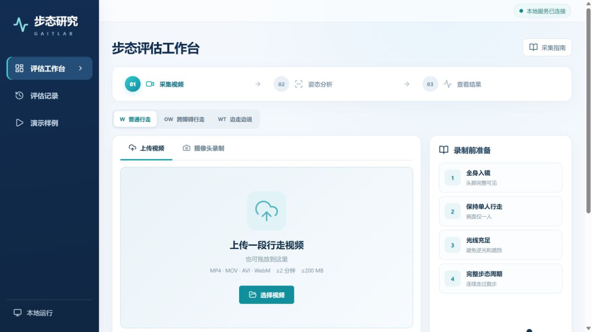
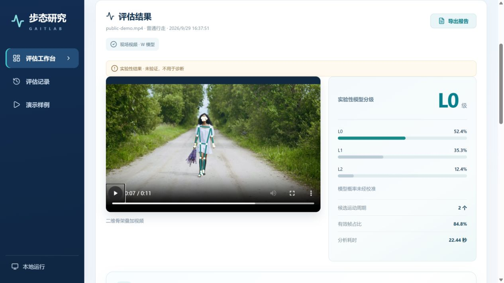
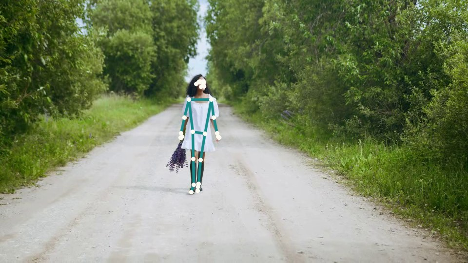
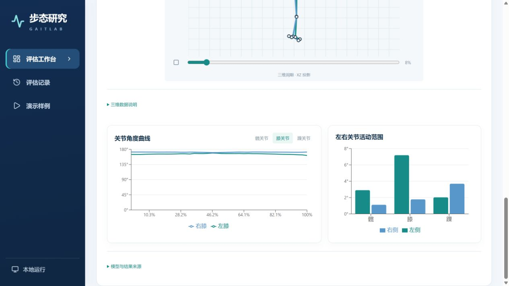
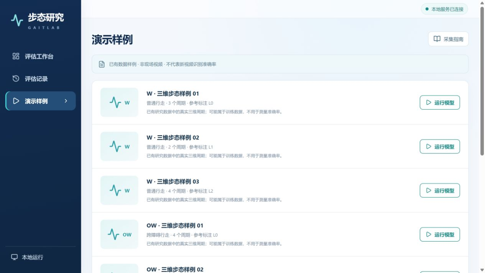

# GaitLab · 步态功能评估工作台

GaitLab 是面向**帕金森病辅助诊断研究**的本地步态视频分析工作台。它将行走视频转为人体姿态、关节运动曲线和步态功能分级，为临床人员观察运动异常提供量化参考。当前系统输出的是步态功能信息，**不直接判断是否患有帕金森病**；诊断仍需结合病史、症状和神经系统检查。前端采用 React，分析服务采用 FastAPI，数据保存在本地 SQLite。

## 产品预览

以下截图来自实际运行的工作台；结果图由一次真实的视频上传与模型分析生成，没有使用概念图或手填结果。演示视频选用 [cottonbro studio 发布的 Pexels 素材](https://www.pexels.com/video/woman-in-white-dress-walking-outdoors-4887672/)（[Pexels 使用许可](https://www.pexels.com/license/)）。画面人物是素材演员，**不是患者或研究受试者**；图中的分级是未验证的实验性模型输出，不代表其健康状况，也不用于诊断。

**视频上传工作台**



**上传后结果：骨架叠加视频与模型输出**



**骨架叠加视频的原始画面**



**关节曲线与左右侧对比**



**W、OW、WT 场景样例入口**



## 产品功能

- **采集**：上传视频或使用笔记本摄像头录制，预览确认后开始处理。
- **观察**：查看骨架叠加、有效帧比例、关节角度曲线、左右侧对比和五维步态观察画像。
- **管理**：保存本地评估记录，重新打开结果，或通过浏览器打印导出 PDF。
- **样例**：使用已有三维步态数据运行 W、OW、WT 场景的对应模型。

工作台支持 MP4、MOV、AVI 和 WebM；单个文件上限为 200 MB、两分钟。实际能否解码取决于本机视频组件。

## 模型与已有评估结果

下表采用项目原有训练实验的**按受试者汇总交叉验证**结果，准确率是各折均值，`±` 后为折间标准差；它们不是新上传视频的识别准确率。

| 场景 | 当前模型 | 按受试者准确率 | Macro-F1 |
| --- | --- | ---: | ---: |
| W · 普通行走 | 原始步态周期 ExtraTrees | **63.99% ± 9.64%** | 61.75% |
| OW · 跨障碍行走 | 原始 CNN1D | **86.57% ± 9.82%** | 81.00% |
| WT · 边走边说 | 原始 CNN1D | **57.77% ± 5.39%** | 39.38% |

数值、来源文件与统计口径见[模型评估说明](docs/model-evaluation.md)。不同场景的数据规模及类别分布不同，不能用这三个数字直接比较场景难度。权重与配置的 SHA-256 标识见 [`gait-demo/model_manifest.json`](gait-demo/model_manifest.json)。

## 当前视频链路

```text
视频 → MediaPipe 二维姿态 → VP3D 三维重建 → 周期处理 → 步态图表
                                                       └─ W：原始 ExtraTrees 实验性分级
```

W 新视频已接通上述模型推理，但视频预处理尚未证明与原训练数据完全一致，因此该分级标为**实验性**。OW、WT 新视频目前提供姿态和运动预览；对应 CNN1D 可运行已有三维数据样例，尚未接通新视频分类。雷达图的五项数值来自显式计算规则，采用 0–100 展示刻度，不是临床评分。

本项目是辅助诊断研究原型，尚未完成临床有效性验证，不能单独用于诊断或临床决策。帕金森病的临床诊断需要综合病史、症状与体格检查，参见 [Parkinson's Foundation 的诊断说明](https://www.parkinson.org/understanding-parkinsons/getting-diagnosed)。

## 从源码启动

推荐 Windows 10/11、64 位 Python 3.13、Node.js 和 npm。首次安装依赖需要联网；PyTorch 体积较大，请预留磁盘空间。

```powershell
git clone https://github.com/belphogr/gait-research-workbench.git
cd gait-research-workbench
py -3.13 -m venv .venv
.\.venv\Scripts\python.exe -m pip install -r requirements-portable.txt
cd gait-demo\frontend
npm ci
npm run build
cd ..\..
.\.venv\Scripts\python.exe gait-demo\run.py --open
```

默认访问地址为 `http://127.0.0.1:8000/`。本仓库公开的是**源码**，不包含模型权重、姿态资产、研究样本或受试者视频；单独克隆后可构建并查看界面，模型分析需要项目组内部资产。组内完整运行包为 `步态Demo_队友版.zip`，内有资产、启动脚本与使用说明。将其资产接入源码时，需提供 `models/`、`gait-demo/assets/`、`gait-demo/pose_vendor/`、`gait-demo/recovered-vp3d/` 及匹配的 `gait-demo/video_pipeline.json`，并核对清单中的哈希值。

## 项目结构

```text
gait-demo/backend/          API、模型适配与视频处理
gait-demo/frontend/src/     页面和图表
gait-demo/model_manifest.json  模型与配置标识
gait-demo/run.py            本地服务入口
docs/                       产品截图与模型评估说明
requirements-portable.txt  Python 依赖
```

## 研究参考

项目参考 Kaur 等人的 [2023 年视觉步态研究](https://doi.org/10.1109/JBHI.2022.3208077) 及其[公开代码仓库](https://github.com/kaurrachneet6/Vision-Based-Gait-Analysis-Framework-for-Predicting-Multiple-Sclerosis)。原框架有独立许可证；本仓库不包含其完整源码或训练数据。模型、VP3D 文件和研究样本由项目组内部管理。
